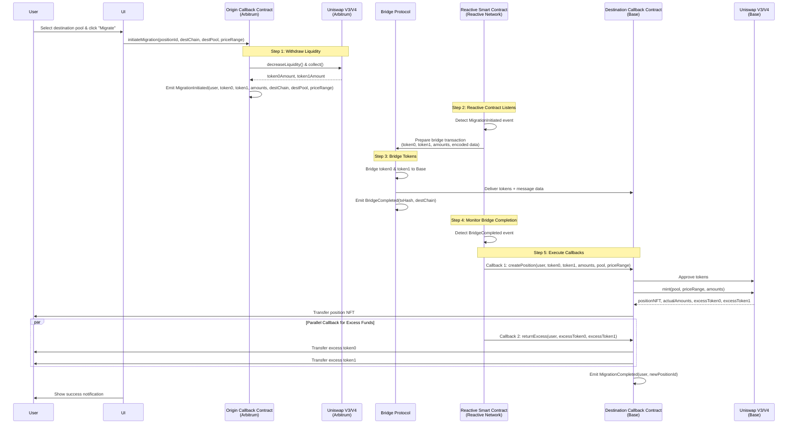

# Uniswap Position Migration via Reactive Network

## Overview

This project enables seamless cross-chain migration of Uniswap V3/V4 liquidity positions using Reactive Network's trustless automation capabilities. Users can migrate their liquidity positions from one chain to another (e.g., WETH/WBTC from Arbitrum to Base) with a single click, eliminating the need for manual withdrawal, bridging, and position recreation.

### The Problem

Traditionally, migrating a Uniswap position across chains requires multiple manual steps:
- Withdraw liquidity from the original position
- Bridge each token separately to the destination chain
- Manually recreate the position on the destination chain
- Handle slippage and excess tokens

### The Solution

Using Reactive Smart Contracts (RSCs), we automate the entire migration process. RSCs listen for on-chain events and trigger cross-chain workflows, enabling a true one-click migration experience that is:
- **Trustless**: All operations executed via smart contracts
- **Automated**: Event-driven workflow handles all steps
- **Cross-chain**: Works between any supported blockchain networks
- **User-friendly**: Single transaction initiates the entire process

## Architecture



## Step-by-Step Process

### Step 1: Migration Initiation (Origin Chain)

**User Action:**
- User selects their existing Uniswap position (e.g., WETH/WBTC on Arbitrum)
- Chooses destination chain (e.g., Base) and target pool
- Specifies desired price range for the new position
- Clicks "Migrate" button

**Origin Callback Contract:**
- Receives `initiateMigration()` call with position details
- Interacts with Uniswap V3/V4 to withdraw liquidity:
  - Calls `decreaseLiquidity()` to remove all liquidity from position
  - Calls `collect()` to collect token0 and token1 amounts
- Emits `MigrationInitiated` event containing:
  - User wallet address
  - Token0 and Token1 addresses
  - Withdrawn amounts
  - Destination chain ID
  - Destination pool address
  - Target price range (tickLower, tickUpper)

### Step 2: Reactive Contract Detection

**Reactive Smart Contract (on Reactive Network):**
- Continuously monitors origin chain for `MigrationInitiated` events
- Detects the migration event for the user's transaction
- Extracts all migration parameters from the event data
- Encodes position parameters (pool, price range, user address) into message data
- Prepares bridge transaction payload with:
  - Token addresses
  - Token amounts
  - Encoded migration parameters
  - Destination chain and contract address

### Step 3: Cross-Chain Token Bridge

**Bridge Protocol:**
- Receives bridge request from Reactive Contract
- Locks/burns token0 and token1 on origin chain
- Transfers tokens across chains using bridge infrastructure
- Mints/unlocks token0 and token1 on destination chain
- Delivers tokens to Destination Callback Contract
- Forwards encoded migration parameters as message data
- Emits `BridgeCompleted` event with transaction details

### Step 4: Bridge Completion Monitoring

**Reactive Smart Contract:**
- Monitors bridge protocol for `BridgeCompleted` event
- Verifies bridge transaction corresponds to the migration
- Confirms tokens successfully delivered to destination chain
- Triggers automated callbacks to Destination Callback Contract

### Step 5: Position Recreation (Destination Chain)

**Callback 1 - Create New Position:**

The Reactive Contract sends the first callback to Destination Callback Contract:

- Receives bridged token0 and token1
- Approves both tokens for Uniswap V3/V4 router
- Calls Uniswap's `mint()` function with:
  - Destination pool address
  - Price range (tickLower, tickUpper)
  - Token amounts
  - User address as position recipient
- Uniswap creates the new liquidity position
- Position NFT is minted directly to user's wallet
- Contract calculates actual amounts used vs. received (due to slippage)

**Callback 2 - Return Excess Tokens:**

Simultaneously, the Reactive Contract sends a second callback:

- Calculates excess tokens:
  - `excessToken0 = receivedAmount0 - usedAmount0`
  - `excessToken1 = receivedAmount1 - usedAmount1`
- Transfers any excess token0 back to user's EOA
- Transfers any excess token1 back to user's EOA
- Ensures user doesn't lose funds due to price differences or slippage

### Step 6: Migration Completion

**Destination Callback Contract:**
- Emits `MigrationCompleted` event with:
  - User address
  - New position NFT ID
  - Actual amounts deposited
  - Excess amounts returned
- Event logged on destination chain for tracking

**UI Updates:**
- Listens for `MigrationCompleted` event
- Displays success notification to user
- Shows new position details (NFT ID, liquidity, range)
- Confirms excess token returns

## Key Components

### Origin Callback Contract
- Deployed on source chain (e.g., Arbitrum)
- Integrates with Uniswap V3/V4 position manager
- Handles liquidity withdrawal
- Emits migration events for Reactive Network

### Destination Callback Contract
- Deployed on target chain (e.g., Base)
- Receives bridged tokens from bridge protocol
- Integrates with Uniswap V3/V4 on destination
- Creates new positions
- Manages excess token returns
- Receives callbacks from Reactive Contract

### Reactive Smart Contract
- Deployed on Reactive Network
- Event-driven automation layer
- Monitors both origin and destination chains
- Triggers cross-chain workflows
- Coordinates bridge and callback execution
- Ensures trustless automation

### Bridge Integration
- Cross-chain messaging protocol
- Transfers tokens between chains
- Carries encoded position parameters
- Emits completion events

## Benefits

✅ **One-Click Migration**: User approves once, automation handles everything

✅ **Trustless Execution**: All logic executed via audited smart contracts

✅ **Cross-Chain Support**: Works between any Reactive-supported chains

✅ **Automatic Slippage Handling**: Excess tokens automatically returned

✅ **Position Ownership**: New position NFT minted directly to user's wallet

✅ **No Token Loss**: All excess amounts returned to user

✅ **Parallel Processing**: Position creation and excess returns happen simultaneously

## Use Cases

- **Liquidity Farming**: Move positions to chains with better yields
- **Gas Optimization**: Migrate to lower-cost chains
- **Market Opportunities**: Follow liquidity to active markets
- **Network Upgrades**: Move positions during chain migrations
- **Risk Management**: Diversify positions across multiple chains

## Technical Stack

- **Smart Contract Language**: Solidity
- **DEX Protocol**: Uniswap V3 and V4
- **Automation Layer**: Reactive Network RSCs
- **Origin Chains**: Arbitrum, Ethereum, Optimism, etc.
- **Destination Chains**: Base, Polygon, Avalanche, etc.
- **Bridge**: Cross-chain messaging protocol (configurable)

## Event Structure

### MigrationInitiated Event
```solidity
event MigrationInitiated(
    address indexed user,
    uint256 indexed positionId,
    address token0,
    address token1,
    uint256 amount0,
    uint256 amount1,
    uint256 destChainId,
    address destPool,
    int24 tickLower,
    int24 tickUpper
);
```

### BridgeCompleted Event
```solidity
event BridgeCompleted(
    bytes32 indexed bridgeTxHash,
    uint256 indexed destChainId,
    address destContract
);
```

### MigrationCompleted Event
```solidity
event MigrationCompleted(
    address indexed user,
    uint256 indexed newPositionId,
    uint256 amount0Used,
    uint256 amount1Used,
    uint256 excessToken0,
    uint256 excessToken1
);
```

## Future Enhancements

- Support for multi-hop bridges
- Automated price range optimization
- Batch migration for multiple positions
- Integration with additional DEX protocols
- Rebalancing strategies during migration
- Fee tier selection optimization

---

**Built with Reactive Network - Web3's first trustless cross-chain automation protocol**
